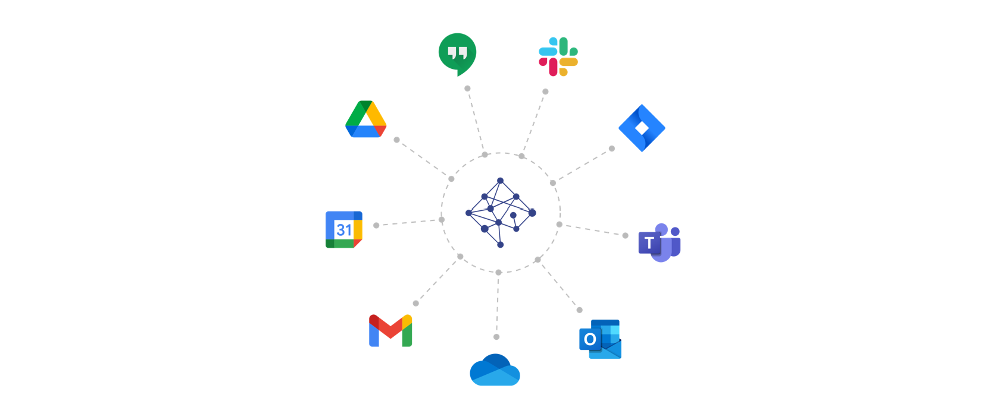

<div align="center">  
  <br>
  <h3 align="center">NetworkPerspective.Sync</h3>
  <p align="center">
    This project contains connectors from that syncs anonymous metadata from various sources to Network Perspective API.    
    <br /><br/>
    <a href="infra/readme.md"><strong>Private cloud deployment »</strong></a>
    <br />
    <a href="docs/create-slack-bot.md">Create Slack bot</a>
    ·
    <a href="docs/create-google-api-keys.md">Create Google API Keys</a>
    ·
    <a href="docs/authorize-google-api-keys.md">Authorize Google API Key</a>    
    <br/><br/>
    Technical reference for individual connectors<br/>
    <a href="docs/google-connector.md">Google Workspace</a> 
    ·
    <a href="docs/google-connector.md">Slack</a> 
    · Office365
    · Cli
  </p>
</div>

## Project organization
    ├── src
    │   ├── *.Gsuite               <- GSuite connector
    │   ├── *.Slack                <- Slack connector
    │   ├── *.Office365            <- Office365 connector
    │   ├── *.Cli                  <- Cli connector
    │   ├── *.Application          <- Common application layer
    │   ├── *.Infrastructure       <- Infrastructure layer
    │   ├── *.Dockefile            <- Docker build scripts    
    │   └── *.Tests                <- Tests
    ├── docs                       <- Documentation
    └── infra                      <- Infrastructure scripts
        └── helm-charts            <- helm charts

## Getting started
Project is developed using Visual Studio 2022 and .net core 6.0. The solution file is in the src folder. 
```
src/NetworkPerspective.Sync.sln
```
Building the code requires .net core 6.0 sdk.
```
dotnet build .\src\NetworkPerspective.Sync.sln
```
You can run individual projects from Visual Studio or with `dotnet run` however there also `Tiltfile` prepared to simplify running connectors on local kubernetes. Please refer to [tilt.dev docs](https://docs.tilt.dev/) on getting started. 
```
tilt up
```
The above command will deploy connectors along Sql Server Developer edition to your local kubernetes.

## Data flow
Each connector is a small app that fetch data from some source and pushes it to Network Perspective API. All personal data is pseydonymized using HMAC algorithm, i.e. hashed with a secret key. 


Connectors transform received data to interactions between employees - a temporal graph model that attempts to unify different types events. In general an interaction is directed edge - a triplet When (Timestamp), From (SourceVertex), To (TargetVertex) with optional additional Properties describing the event or particular interaction. 

Example data coming from connectors:

| When              | From     | To       | Event    | Type     | 
|-------------------|----------|----------|----------|----------|
| 2022-07-08 11:00  | 5f0da40c | 4abc0eef | 37e284cb | Chat     |
| 2022-07-08 11:15  | c5417a39 | 4395fa80 | 711665af | Email    |
| 2022-07-08 13:00  | fcd030aa | a277e6c3 | dc5cf92b | Meeting  |


## Deployment

### Saas
Network Perpsective hosts connectors within own Azure cloud infrastructure - the easiest way to go is just to authorize them, this takes just a few minutes and can be done from within the Network Perspective App admin panel. 

### Private cloud
However if your secuity requires having connectors within your infrastructure, we made easy to do it. All connectors are contenerized and helm chart is prepared for ease of deployement. That being said they main supported deployment platform is kubernetes. 
[Read more](infra/readme.md)


## Privacy and security principles
* **Data minimization**: only data required is included in the scope and fetched from source systems.
* **Data anonymization**: data is securely transformed (identifiers cryptographically modified to make them not linkable with individuals; data points related to individuals obfuscated).
* **On the fly data anonymization**: data is transformed and only the resulting anonymized data is passed on . Data fetched from source systems by connectors should not be stored on disk.
* **GDPR-compliance**: connectors and built with GDPR compliance in mind.
A risk analysis and Data Protection Impact Analysis (DPIA) has been performed for standard implementation model to support Data Processors to meet their regulatory obligations.