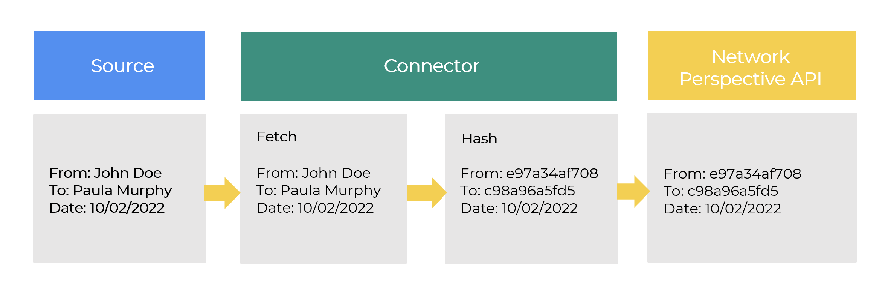
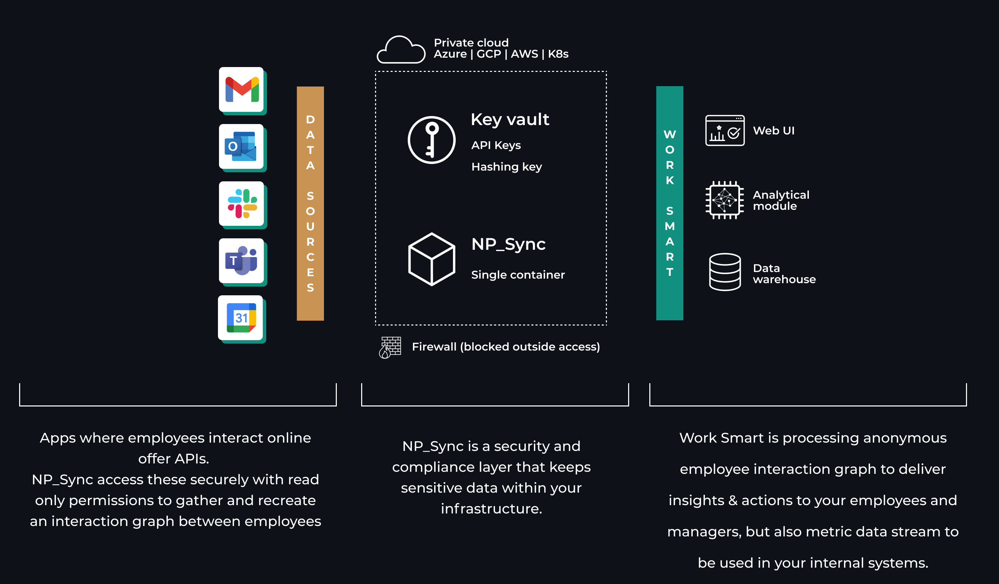
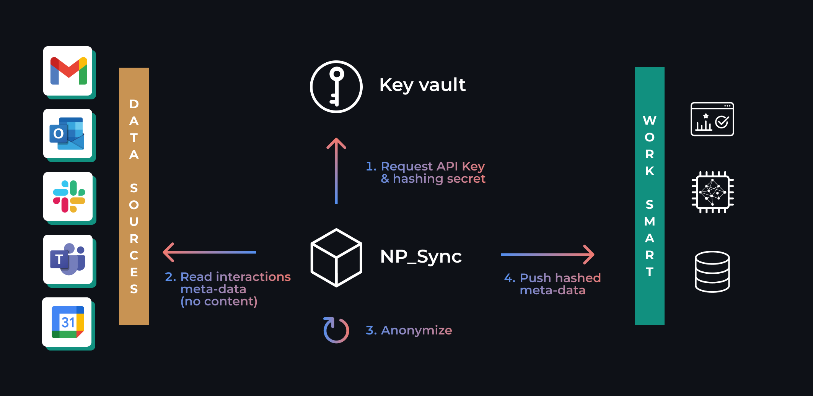

## About
NP_Sync is a containerized app that syncs pseudonymized employee interaction metadata to enable Work Smart analysis. 
It acts as a security and compliance layer that keeps all direct data access within your infrastructure.
It is easy to deploy, fully transparent, open sourced and auditable.

## Security
NP_Sync is deployed behind a firewall with no access from outside.
All secrets (API keys, hashing key) are stored in a Key Vault enabling secure access and full audit trial. Cloud vendor specific Key Vault implementations are supported. All code is open sourced and fully auditable. 

## Privacy & data protection
All personally identifiable information is hashed using irreversible HMAC algorithm with a key that is only in your possession.

NP_Sync accesses only metadata to extract employee interaction graph. No content of communication is ever processed.

Example data coming from connectors:

| When              | From     | To       | Event    | Type     | 
|-------------------|----------|----------|----------|----------|
| 2022-07-08 11:00  | 5f0da40c | 4abc0eef | 37e284cb | Chat     |
| 2022-07-08 11:15  | c5417a39 | 4395fa80 | 711665af | Email    |
| 2022-07-08 13:00  | fcd030aa | a277e6c3 | dc5cf92b | Meeting  |

### Privacy and security principles
* **Data minimization**: only data required is included in the scope and fetched from source systems.
* **Data anonymization**: data is securely transformed (identifiers cryptographically modified to make them not linkable with individuals; data points related to individuals obfuscated).
* **On the fly data anonymization**: data is transformed and only the resulting anonymized data is passed on . Data fetched from source systems by connectors should not be stored on disk.
* **GDPR-compliance**: connectors and built with GDPR compliance in mind.
A risk analysis and Data Protection Impact Analysis (DPIA) has been performed for standard implementation model to support Data Processors to meet their regulatory obligations.

## Deployment
NP_Sync consists of just one container and a Key Vault.
Due to simplicity it can be easily deployed in any major cloud like Azure, GCP, AWS but also Kubernetes or other environments that support Docker.

# Data and information flow

1) NP_Sync requests API access key and a hashing key from Key Vault 
2) Reads interactions from collaboration tool API
3) Removes any PII and hashes identifiers with the hashing key
4) Employee interaction graph is pushed to Work Smart api
5) Work Smart analytical module processes anonymous data and computes over 100 metrics describing collaboration
6) Metrics are presented via Web UI to end users, secured with SSO

## SaaS
Network Perpsective hosts connectors within own Azure cloud infrastructure - the easiest way to go is just to authorize them, this takes just a few minutes and can be done from within the Network Perspective App admin panel. 
