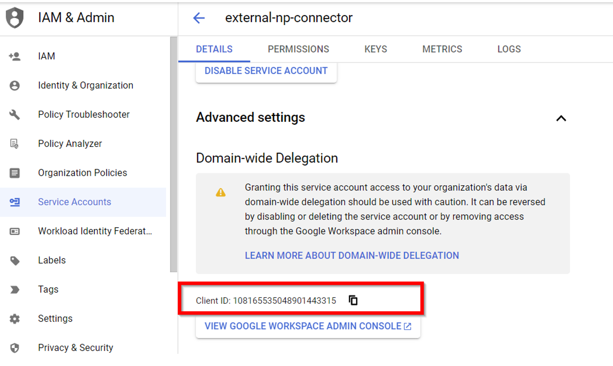

# Authenticate Google service account to access Google Tenant
To allow your Google Service Account access to your Google Tenant, follow the steps below:

### 1. Navigate to the API Controls in Admin Console
- Begin by logging into your Google Workspace domain's [Admin console](https://admin.google.com).
- Navigate through the following path: `Main menu > Security > Access and data control > API controls`

### 2. **Manage Domain Wide Delegation**
- Within the `Domain wide delegation` section, choose `Manage Domain Wide Delegation`.
- Next, click on `Add new`.

### 3. **Enter Client ID and OAuth Scopes**
- For the `Client ID` field, input the client ID associated with your service account.<br/><br/>

- In the `OAuth Scopes` section, provide a comma-separated list of required scopes for the connector:
    ```
    https://www.googleapis.com/auth/admin.directory.user.readonly, https://www.googleapis.com/auth/calendar.readonly, https://www.googleapis.com/auth/gmail.metadata
    ```

- Finally, click on `Authorize`.

