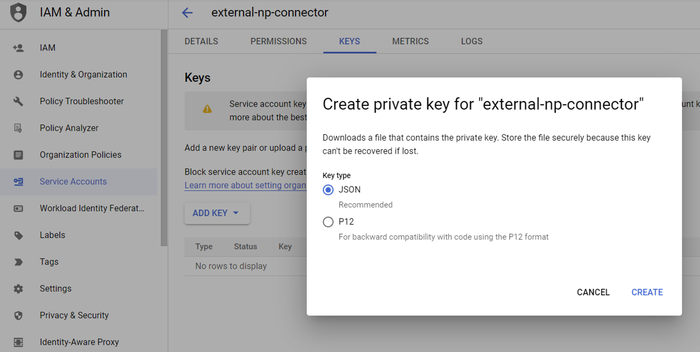

# Creating Google Workspace API keys

## Create a new project
https://console.cloud.google.com/projectcreate

Name: "Network Perspective" (this exact name is reqiured)

## Enable APIs
Go to api dashboard at:
https://console.cloud.google.com/apis/dashboard

#### Gmail API 
https://console.cloud.google.com/apis/library/gmail.googleapis.com

#### Google Calendar API 
https://console.cloud.google.com/apis/api/calendar-json.googleapis.com

#### Admin SDK
https://console.cloud.google.com/apis/api/admin.googleapis.com

## Create Service Account Credentials
Reference
https://developers.google.com/workspace/guides/create-credentials#service-account

#### Create Account
https://console.cloud.google.com/iam-admin/serviceaccounts/create

#### Add a JSON key

## Save generated file contents
Keep them confidential as they allow access to your Google workspace.
