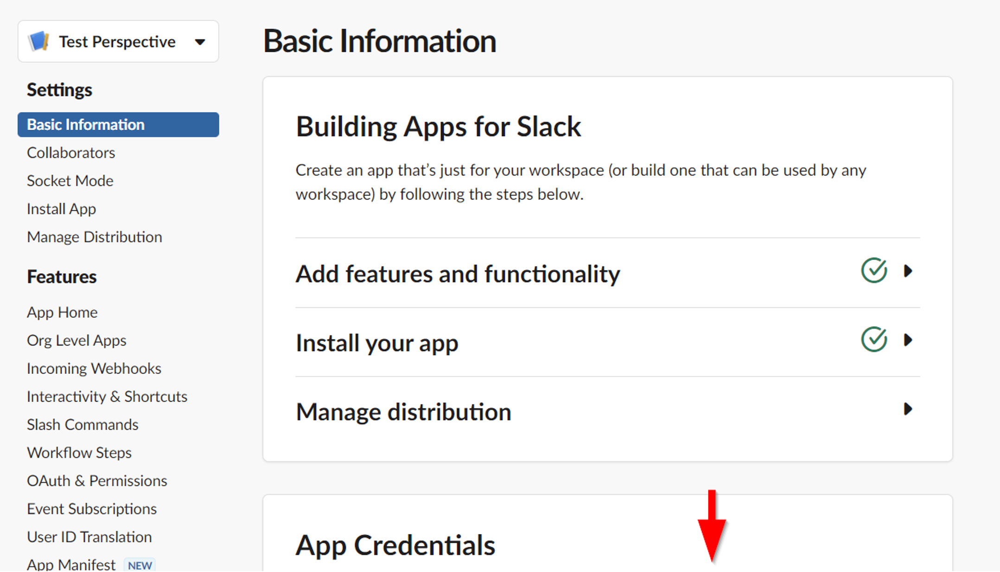

# Creating a Slack bot
For a comprehensive guide on creating Slack bots, refer to the
[official documentation](https://api.slack.com/bot-users). This document provides a concise walkthrough on setting up a Slack bot.

## Create a Slack APP
* Navigate to Slack's [new app creation page](https://api.slack.com/apps/new).
* Select the "From manifest" option.
* Use the provided manifest file <a href="slack/slack-bot-manifest.yml">slack-bot-manifest.yml</a> and the bot icon <a href="slack/slack-np-bot-icon.png">slack-np-bot-icon.png</a>.

## Gather client id and secret
On the same page, scroll down to App Credentials.



You should find there two values that look like this:

ClientId
```
812345678998371.3951234567895
```

ClientSecret
```
2431234567891234567893478236487
```

Keep them confidential as they allow access to your slack workspace.