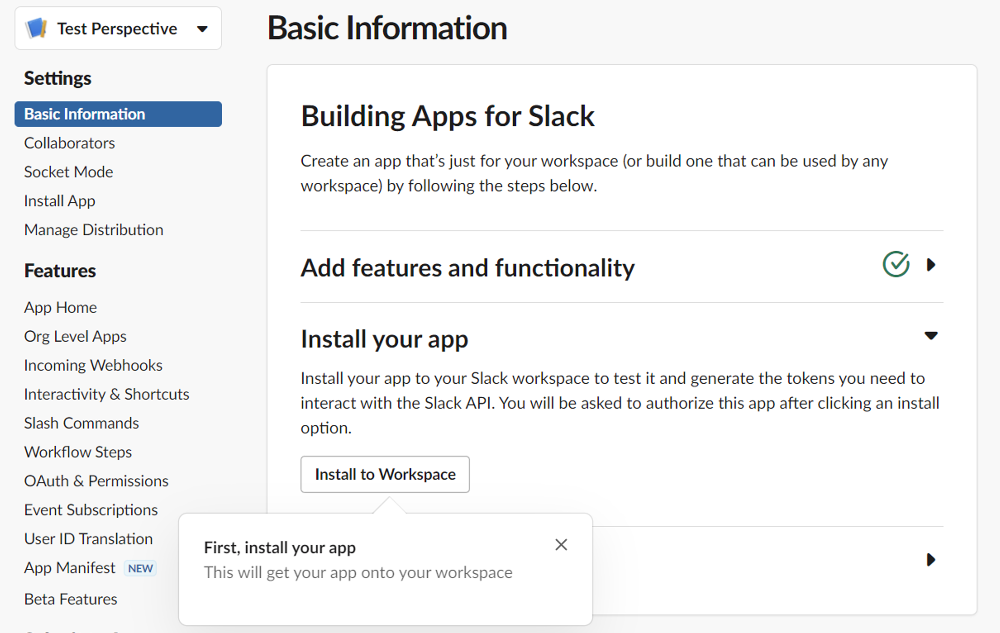

# Creating a Slack bot
Please refer to 
[official documentation](https://api.slack.com/bot-users) for details concerning creating slack bot.

## Create a Slack APP
Go to url:
https://api.slack.com/apps/new 

Choose "From manifest" and use manifest file <a gref="slack/slack-bot-manifest.yml">slack-bot-manifest.yml</a> and image
<a gref="slack/slack-np-bot-icon.png">slack-np-bot-icon.png</a> 

## Install app into your workspace:


## Gather client id and secret


You should find there two values that look like this:

ClientId
```
812345678998371.3951234567895
```

ClientSecret
```
2431234567891234567893478236487
```

Keep them confidential as they allow access to your slack workspace.