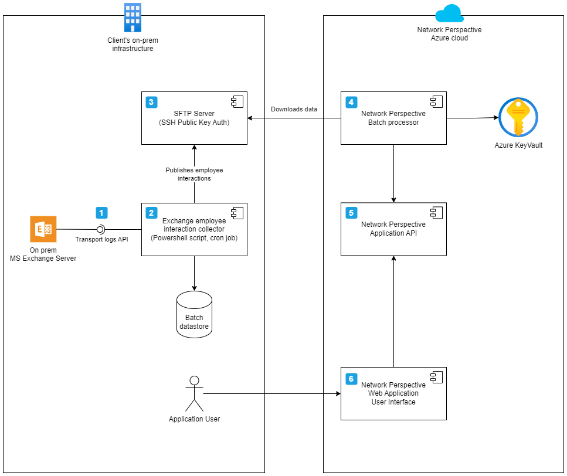

# MS Exchange integration

Network Perspective offers a way to handle interaction data extracted from on prem MS Exchange. This page describes briefly steps necessary to extract the metadata. 


## Overview


Components included on the diagram:

1. **MS Exchange API** - the solution uses MS Exchange Transport Logs api to infer interactions between employees. How to extract them is in details described in further part of this document.
2. **Employee interaction collector** - is a set of powershell scripts that extracts interactions from MS Exchange transport logs. The script loops over a list of employyes and downloads exchange email transport logs and calendar events diagnostic logs for each employee. It might use some form of backend storage (DB or flat file) to save temporary employee data. At the end of the process all employee data is hashed and merged into a few CSV files, and finally published on an SFTP server.
3. **SFTP Server** - this is a secure point for data exchange between customer and Network Perspective. Access might be limited to single static ip address from which Network Perpsective is allowed to connect.
4. **Batch processor** - a component in Network Perspective's infrastructure that securely downloads data from SFTP server, applies post processing if necessary and pushes data to Network Perspective API. Private key for SSH auth (and other credentials) is kept secure in Azure KeyVault.
5. **Network Perspective API** - a generalized API shared by all different connectors. Accepts data, and forwards it to Analytical Module (not included in the diagram) for further processing. Provides endpoints necessary for functioning of Web User Interface.
6. **Web user interface** - Network Perspective provides Web User Interface that makes it easy for users to acccess Work Smart Report and actions that drive work habits improvement. UI might be accessed over the internet, but there is also an option to limit access to whielisted set of ip addresses (or a subnet). There are multiple authentication options available including Azure AD Signle Sign On.


# Implementation details

## Hashing
Please note that all data should be anonymized using HMAC function such as below:

<details>
<summary>HMAC code snippet</summary>

```
function Get-HMACSHA256 {
    param (
        [string]$message,
        [string]$secret
    )
    # passthrough for empty values and magic strings
    if ($message -eq $null -or $message -eq 'external' -or $message -eq 'internal' -or $message -eq 'error') {
        return $message
    }
    
    $hmacsha = New-Object System.Security.Cryptography.HMACSHA256
    $hmacsha.key = [System.Text.Encoding]::UTF8.GetBytes($secret)
    
    $data = [System.Text.Encoding]::UTF8.GetBytes($message)
    $hash = $hmacsha.ComputeHash($data)
    
    $hashString = [System.Convert]::ToBase64String($hash)

    return $hashString    
}
```

</details>

## Filtering
The data exported should contain employee interactions, hence all service accounts and other artificial accounts like conference rooms email, etc. should be excluded from exported data.

# Exporting emails

To export email metadata use powershell function:
```
Get-MessageTrackingLog
```
* Output from the powershell function should be processed, to match the expected resulting format. 
* If an email is sent to multiple recipients (using `to` or `cc` fields) then it should create multiple rows in the resulting table describing email interactions but sharing the same email_id. 

| email_id  | from             | to               | when                      |
|-----------|------------------|------------------|---------------------------|
| 6cd886f6  | test@example.com | alice@example.com | 2023-06-01 06:36:56.042   |
| 8fa8e7b2  | alice@example.com | test@example.com | 2023-06-01 07:15:32.157   |
| 9dd5ca05  | test@example.com | bob@example.com  | 2023-06-01 08:00:47.003   |
| 0c5a889c  | john@partner.com | test@example.com | 2023-06-01 08:45:12.876   |

Finally all identifiers should be hashed with HMAC function resulting in `csv` file similar to table below [or a raw csv](./custom-integration/2023-06_emails.csv).

| email_id  | from     | to       | when                      |
|-----------|----------|----------|---------------------------|
| 6cd886f6  | a9f6b2c1 | d3e4f5a6 | 2023-06-01 06:36:56.042   |
| 8fa8e7b2  | d3e4f5a6 | a9f6b2c1 | 2023-06-01 07:15:32.157   |
| 9dd5ca05  | a9f6b2c1 | b7c8d9e0 | 2023-06-01 08:00:47.003   |
| 0c5a889c  | `external` | a9f6b2c1 | 2023-06-01 08:45:12.876   |

Please note the `external` identifier that is used to mark interactions with people outside of the organization.

# Exporting meetings
Exchange offers limited api to exporting meeting interactions. There are diagnostic logs that allow exporting all events associated with creating, updating, deleteing meetings. These event log can be used to recrete meeting metadata.

To export meetings metadata use functions:
```
Get-CalendarDiagnosticLog 
Get-CalendarDiagnosticAnalysis
```

The resulting information from the `Get-CalendarDiagnosticAnalysis` looks similar to the table below.

| logtime                 | starttime           | endtime             | normalizedsubject | calendarlogtriggeraction | originallastmodifiedtime | itemclass       | duration | appointmentrecurring | sentrepresentingemailaddress | senderemailaddress | itemversion | appointmentsequencenumber | isexception | responsibleusername     | appointmentstate | globalobjectid    | creationtime           | lastmodifiedtime       | timezone                    | recurrencetype | appointmentrecurrenceblob | mapiisalldayevent |
|-------------------------|---------------------|---------------------|-------------------|--------------------------|--------------------------|-----------------|----------|-----------------------|------------------------------|--------------------|-------------|--------------------------|-------------|-------------------------|------------------|-------------------|------------------------|------------------------|-----------------------------|----------------|---------------------------|-------------------|
| 2023-06-01 11:41:45.406 | 2023-06-01 12:30:00 | 2023-06-01 13:30:00 | Meeting with Bob  | Update                   | 2023-06-01 11:41:45.406  | IPM.Appointment | 60       | False                 | test@example.com                   | test@example.com           | 11          | 3                       | True        | Microsoft System Attendant | 1.0              | 060000008...      | 2023-06-01 12:16:58.997 | 2023-06-01 12:16:59.004 | (UTC+01:00) Sarajevo, Skopje, Warsaw, Zagreb | Weekly        | 00232000000A....                  | True                |
| 2023-06-02 09:30:15.312 | 2023-06-02 10:00:00 | 2023-06-02 11:00:00 | Team Standup      | Create                   | 2023-06-02 09:30:15.312  | IPM.Appointment | 60       | False                 | bob@example.com                   | bob@example.com           | 12          | 4                       | False       | Alice                     | 2.0              | 060000008...      | 2023-06-02 09:00:00.000 | 2023-06-02 09:30:15.312 | (UTC-08:00) Pacific Time (US & Canada)        | None         |                           | False               |

Before sharing data with Network Perspective please:
* Remove sensitive information from `normalizedsubject` field and 
* Hash email addresses
* Again anytime an email of a person from outside of the organization is encounterd please user `external` identifier instead of hash

The final `csv` file should look similar to the table below [or a raw csv](./custom-integration/2023-06_meetings.csv).

| logtime                 | starttime           | endtime             | normalizedsubject | calendarlogtriggeraction | originallastmodifiedtime | itemclass       | duration | appointmentrecurring | sentrepresentingemailaddress | senderemailaddress | itemversion | appointmentsequencenumber | isexception | responsibleusername     | appointmentstate | globalobjectid    | creationtime           | lastmodifiedtime       | timezone                    | recurrencetype | appointmentrecurrenceblob | mapiisalldayevent |
|-------------------------|---------------------|---------------------|-------------------|--------------------------|--------------------------|-----------------|----------|-----------------------|------------------------------|--------------------|-------------|--------------------------|-------------|-------------------------|------------------|-------------------|------------------------|------------------------|-----------------------------|----------------|---------------------------|-------------------|
| 2023-06-01 11:41:45.406 | 2023-06-01 12:30:00 | 2023-06-01 13:30:00 |   | Update                   | 2023-06-01 11:41:45.406  | IPM.Appointment | 60       | False                 | a9f6b2c1                   | a9f6b2c1           | 11          | 3                       | True        | Microsoft System Attendant | 1.0              | 060000008...      | 2023-06-01 12:16:58.997 | 2023-06-01 12:16:59.004 | (UTC+01:00) Sarajevo, Skopje, Warsaw, Zagreb | Weekly        | 00232000000A...                  | True                |
| 2023-06-02 09:30:15.312 | 2023-06-02 10:00:00 | 2023-06-02 11:00:00 |       | Create                   | 2023-06-02 09:30:15.312  | IPM.Appointment | 60       | False                 | b7c8d9e0                   | b7c8d9e0           | 12          | 4                       | False       | b7c8d9e0                     | 2.0              | 060000008...      | 2023-06-02 09:00:00.000 | 2023-06-02 09:30:15.312 | (UTC-08:00) Pacific Time (US & Canada)        | None         |                           | False               |

# Exporting users and groups

To export users, supervisors, teams and departments please refer to the documentation of the command:
```
Get-ADUser
```

For detailed format on list of users, their respective teams please refer to a document describing [custom integration](./custom-integration.md).