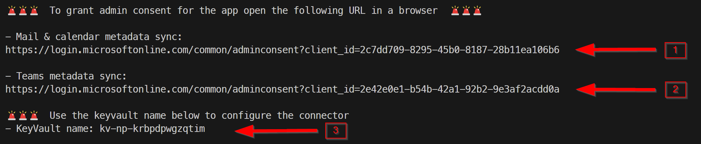

# Azure EntraId Application and KeyVault Configuration Script

## Script source
[Deploy-OfficeConnectorKeyVault.ps1](../infra/azure/Deploy-OfficeConnectorKeyVault.ps1)

## Synopsis
This script automates the creation of an Azure EntraId Application and configures a KeyVault to store the client id and secret. It also registers the application with the necessary permissions.

## Description
The script simplifies the process of setting up an Azure AD Application and KeyVault for storing sensitive credentials. It includes parameters for customizing the resource group, location, firewall settings, and more. The script also outlines the steps for granting admin consent and registering applications with optional Teams permissions. The script is composed of functions and steps to:

* Create Azure resources like resource groups and KeyVault.
* Register Azure AD Applications with and without Teams permissions.
* Set KeyVault policies and configure firewall settings.
* Provide outputs for manual steps like granting admin consent.

## Parameters

- `networkId`: Mandatory. The id of the network (company id) to be synced.
- `resourceGroupName`: Optional. The name of the resource group for KeyVault creation. Default is "rg-networkperspective".
- `location`: Optional. The location for the resource group and KeyVault. Default is "germanywestcentral".
- `firewallIp`: Optional. The IP address for KeyVault firewall rules. Default is "20.79.225.18/32".
- `appCallbackUri`, `npServicePrincipalName`, `npServicePrincipalId`: Various additional optional parameters for configuration.

## Prerequisites
- Azure CLI 2.0 installed.
- Login to Azure CLI before running the script.

## Usage

Script can be run from Azure Cloud Shell. 

1. Login to Azure CLI with `az login`
2. Run the script with the necessary parameters.
3. Follow the output URLs to grant admin consent.

### Example Command
```powershell
.\Deploy-OfficeConnectorKeyVault.ps1 -networkId "28b7d621-46d2-4fd4-8815-3148eefa8d6c" -resourceGroupName "rg-networkperspective" 
```

## Post-Script Actions 🚨

After running the script, please grant admin consent to the created apps. The script will output consent urls similar to presented below:



To complete the process please:
1. Open the provided URL in a browser to grant admin consent to sync mails and calendars metadata.
2. Open the provided URL in a browser to grant admin consent to sync ms teams metadata.
3. Use the KeyVault name output by the script to configure the connector.
