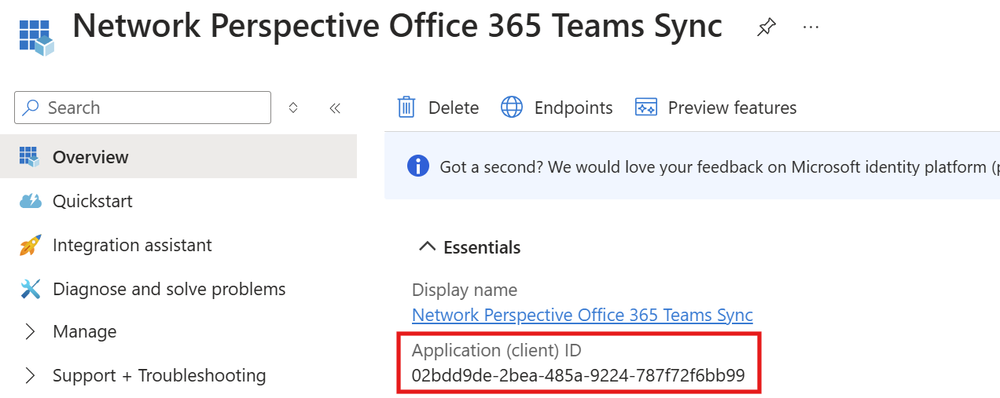

# Scenario
* Slack integration
* Office 365 integration with MS Teams

# Secrets 
The following secrets should be populated for the above scenario. 

### `hashing-key`
Use some randomly generated password. The key is used to anonymize the data as [described here](../../README.md#privacy--data-protection).

### `orchestrator-client-name`
Client name used to connect to Network Perspective app. Value provided by the vendor (Network Perspective).

### `orchestrator-client-secret`
Client secret used to connect to Network Perspective app. Value provided by the vendor (Network Perspective).

### `microsoft-client-with-teams-id`
Client id of application created with Deploy Office Connector script with name "Network Perspective Office 365 **Teams** Sync".




### `microsoft-client-with-teams-secret`
Client secret of application created with Deploy Office Connector script with name "Network Perspective Office 365 **Teams** Sync". You can generate on with the az command via azure cloud shell. Substitute $client_id with the actual client id, i.e. the same as the above secret value `microsoft-client-with-teams-id`

```
az ad app credential reset --id $client_id --display-name "app-secret"
```

### `slack-client-id`
Slack bot client id, available in [slack app admin panel](https://api.slack.com/apps) under "Basic Information" -> "App Credentials". See [screenshot here](../create-slack-bot.md).

### `slack-client-secret`
Slack bot client secret, available in [slack app admin panel](https://api.slack.com/apps) under "Basic Information" -> "App Credentials". See [screenshot here](../create-slack-bot.md).
