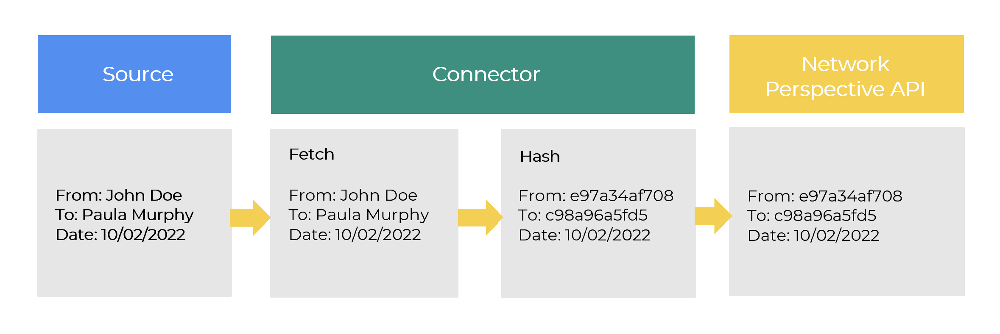

# Google workspace connector

## Introduction and Goals
Slack Connector is a headless application that is the bridge between Slack and Network Perspective System. It periodically fetches Channel interactions data from available API and transfers that data to Network Perspective System. The data should be considered confidential and should be treated with special care. Operation of Slack Connector shall not interfere with other Slack API consumers.

## Requirements Overview
### What is Slack Connector?

The main purpose of Slack Connector is to retrieve data collected in Slack API (employee interactions over public Slack channels), and transfer them to the Network Perspective system while ensuring confidentiality and minimizing data leak risk.

### Main features

* Periodically retrieve data from Slack API
* Converting data in such a way that it is not possible to restore from them the original state, but at the same time that the data would be valuable for the analysis of teams' work habits. 
* Transferring retrieved data to Network Perspective system

### Quality Goals
| No  | Quality   | Motivation  |
|---|---|---|
| 1  | Confidentiality  | Employees data is treated as confidential in several dimensions: GDPR directive, Security by Design, Company know how  |
| 2  | Testability  | The architecture should allow easy testing all main building blocks  |
| 3  | Efficiency  | Big data operations require optimizing processing algorithms  |
| 4  | Interoperability  | The application should provide a simple API, compatible with Network Perspective System.  |
| 5  |  Resiliency | The application depends on external services and it needs to be prepared for scenarios like the unavailability of other services.  |

### Architecture Constraints
#### Technical Constraints
| No  | Constraint   | Background  |
|---|---|---|
| 1  | Implementation in C#  | The application should be written using one of .NET new frameworks that have ongoing Microsoft support, especially for fixing security bugs.  |
| 2  | Deployable to major clouds | As Azure is our main cloud provider, the application should be able to run in Azure Cloud, however on private cloud deployement may target other cloud providers. |
| 3  | Auditable  | The interested developer or architect should be able to check out the sources, compile and run the application without problems compiling or installing dependencies. All external dependencies should be available via the package manager of the operation system or at least through an installer.  |
| 4 | OS agnostic | The application should be compatible with Linux and Windows operating System |

#### Conventions
| No  | Constraint   | Background  |
|---|---|---|
| 1  | Coding conventions  | The project uses [Code Convention for C#](https://docs.microsoft.com/en-us/dotnet/csharp/fundamentals/coding-style/coding-conventions) The conventions are defined through .editorconfig file, and enforced by Continuous Integration Pipeline.  |
| 2  | Language | English. The project targets an international audience, so only English should be used thought the whole project.|

## System Scope and Context
This chapter describes the environment and context of G-Suite Connector. Who uses the system and on which other system does G-Suite Connector depend.

### Business Context
This chapter describes the environment and context of Slack Connector. Who uses the system and on which other system does Slack Connector depend.

#### Administrator

Privileged user responsible for managing secrets such as Slack client secret, Hashing Key

### Key Vault

* [Azure Keyvault](https://docs.microsoft.com/en-us/azure/key-vault/general/basic-concepts) - Secure storage for secrets in Azure Cloud. 
* [HCP Keyvault](https://www.vaultproject.io/) - cloud agnostic secret storage

### Slack-Connector

Fetches employees interactions meta-data across company’s public Slack channels, i.e.:

* Public channel metadata 
  - Channel participants
* Public channel conversation metadata 
  - Who sent a message (or started a new thread)
  - When a message was sent
  - Who was mentioned in a message
  - Who reacted to a message
  - Who replied to a message

**Pushes anonymous data to Network Perspective. Connector never processes content of messages.** All personally identifiable data is hashed further in the connector's pipeline and never saved to any persistent storage or sent to Network Perspective.

### Network Perspective System

Exposes API for incoming data.

## Deployment
There are multiple deployment scenarios for the Slack Connector. Depending on the client’s architecture and security constraints The application may be deployed on the public cloud or on-premise. As all connectors share basic architecture please refer to [Google Connector documentation for deployment scenarios](google-connector.md).

## Concepts
### Persistency
Slack Connector stores only configurations such as, for example, scheduled synchronization jobs.

Data retrieved from Slack API are stored only in-memory for processing time.

### User Interface
Slack is Headless and does not provide any Graphical User Interface. The only exposed interface is a simple REST API with endpoints that allow starting, stopping, and reading synchronization status (enabled / disabled / error) of the connector. 

### Security
For storing secrets such as for, example Slack client secret, Slack Connector, G-Suite Connector uses Azure Key Vault or HCP Vault

For authentication to the Azure Key Vault Connector uses Azure built-in authentication mechanisms.

For authentication to Network Perspective System Connector uses service tokens. Connector is allowed to only push data to Network Perspective without permission to read data already stored in the system.

All communication with external systems is done via encrypted communication channels (TLS).

### Slack Api Client
To communicate with Slack Api the Connector uses Slack Web API. The connector is implemented as a Slack bot. The Connector implements OAuth flow to authorize the client to necessary permissions.

* channels:history - View messages and other content in public channels that your slack app has been added to
* channels:join - Join public channels in a workspace
* channels:read - View basic information about public channels in a workspace
* identify - View information about a user’s identity
* reactions:read - View emoji reactions and their associated content in channels and conversations that your slack app has been added to
* users:profile:read - View profile details about people in a workspace (to identify and filter out bots)
* users:read - View people in a workspace
* users:read:email - View email addresses of people in a workspace

Below tables presents what data are used from Slack API.

#### Employee public channel interactions

| No  | Field   | Type  |
|---|---|---|
| 1	| sender email| string |
| 2	| sender slack id| string |
| 3	| interaction timestamp| string |
| 4	| channel id| string |
| 5	| message id| string|
| 6	| parent message id | string |
| 7	| interaction type | [NewThread, Reply, Reaction] |

## Data Hashing
One of the major requirements is to provide anonymity for fetched data from Slack API. It is achieved by using hashing algorithms to convert basically all information received from Slack, such as employee emails, message ids, etc. to some meaningless string of characters. Slack Connector uses the HMAC256 algorithm to convert values to hashed values. Hashing key is stored in Azure Key Vault. All fields listed in table above, except timestamp and interaction type are hashed before being sent to Network Perspective API.

## Logging
The application uses standard .NET logging mechanisms. In addition, it uses 3rd party library for writing logs to the file system. The application uses different log levels to express different kind of operations. Logs cannot contain any data considered sensitive such as, for example, tokens, employee data, etc.

## Testability
The solution contains XUnit unit tests. The target code coverage is 100% but more important than the value of the metric itself is the coverage of functionalities.