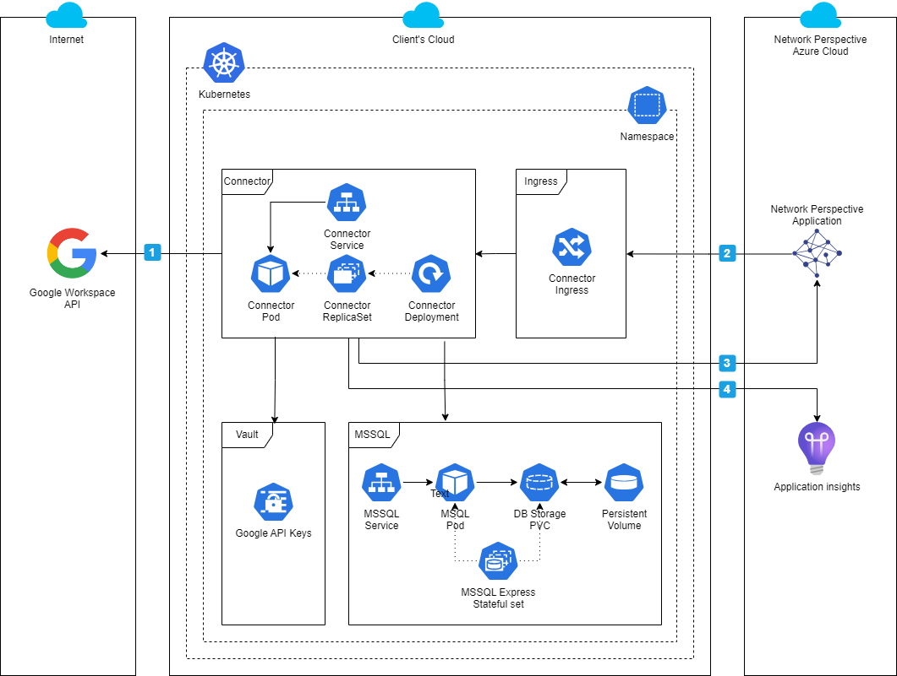

# Private Cloud Deployment
This guide provides step-by-step instructions to deploy connectors on a private cloud.

## Overview
The diagram below illustrates cloud-agnostic deployment on a Kubernetes service. The deployment and updates are automated with a Helm chart that provisions all the connector’s components (Connector, MSSQL Express, Ingress) included in the diagram. Sensitive secrets such as Google API keys can be stored securely HCP Vault, Azure KeyVault or with built-in Kubernetes Secrets mechanisms.



#### Connectivity details
1. Connector (pod) communicates with data source (e.g. Google Workspace API) to fetch employee interaction data.
2. Network Perspective App provides UI to manage the connector (start, stop, basic monitoring). The app connects to connector’s ingress from single whitelisted IP address.
3. Connector uploads anonymized interaction data to Network Perspective API. 
4. Connector publishes logs & telemetry to Network Perspective Application Insights instance. This is optional but highly recommended for troubleshooting and detailed monitoring. 

#### Egress Whitelist
Google connector will access google apis at following domains:
```
www.googleapis.com
gmail.googleapis.com
oauth2.googleapis.com
admin.googleapis.com
```
Google publishes a [range of IP addresses for Google APIs](https://support.google.com/a/answer/10026322?hl=en) and services' default domains.

Slack connector will access slack apis at:
```
slack.com
```
Slack does not publish a list of it's api ip addresses. Hence only Domain-Based Whitelisting is possible. It is a good practice to allow slack token usage from only connector own ip address [as described here](https://api.slack.com/authentication/best-practices#configure-allowed-ip).


All connecectors send data to Network Perspective API:
```
app.networkperspective.io
```
Network Perspective uses a static ip that rarely changes that can be found with `nslookup app.networkperspective.io`. We'll notify all clients before making a change to dns records.

If configured connecteros will also report to Application Insights at:
`germanywestcentral-1.in.applicationinsights.azure.com`

####
## Prerequisites
### Kubernetes Cluster
Connectors are delivered as a Helm chart that can be deployed natively on Kubernetes. To set up your Kubernetes cluster, please refer to your cloud provider documentation.

### Helm
Helm is a package manager for Kubernetes, which helps in defining, installing, and managing even the most complex Kubernetes applications. Install Helm according to the [official documentation](https://helm.sh/docs/intro/install/).

### Powershell 
Most of the scripts are implemented in powershell. To install Powershell please refere to [official documentation](https://learn.microsoft.com/en-us/powershell/scripting/install/installing-powershell). To start powershell and run scripts provided type:
```
pwsh
```
## Dependencies
### Cert Manager
Cert Manager is a native Kubernetes certificate management controller. Connectors use it to issue Let's Encrypt ssl certificates using domain validation. This dependency is not strictly necessary, if other way of providing ssl certificates is available. A script to install cert-manager is provided. 
```
./[cloud-provider]/install-cert-manager.ps1
```
Please refer to [official documentation](https://cert-manager.io/docs/installation/compatibility/) for any compatibility issues with major cloud providers, or just use a script prepared for specific cloud.

### Ingress
Helm chart out of the box supports nginx ingress controller. 
Refer to [this guide](https://kubernetes.github.io/ingress-nginx/deploy/) for more details. The installation script will configure ingress with a static ip address to properly bind a domain name.
```
./[cloud-provider]/install-ingress.ps1
```
## Configuration
### Create secrets
Connector use kubernetes secrets mechanism to keep sensitive information. 

    └── secrets
        ├── acr-login              <- azure container registry login
        ├── acr-password           <- and password
        ├── domain-validation      <- azure dns domain validation secret
        ├── hashing-key            <- hmac key used to psudonymise data
        ├── google-key             <- google service accountkey (json)
        ├── slack-client-id        <- slack client id
        ├── slack-client-secret    <- slack client secret
        ├── staging.yaml           <- staging configuration values
        └── production.yaml        <- production configuration values

Please inspect the secrets and update `hashing-key` to new random sequence of characters. You might also regenerate rsa key using openssl or `create-rsa-key.ps1` script if secrets are stored as k8s secrets. Probably also `google-key` and `slack-client-id` and `slack-client-id` need to be updated with keys and secrets specific for your deployment. 

Please refer to seperate guides to create your secrets:


<a href="../docs/create-slack-bot.md">Create Slack bot</a>
·
<a href="../docs/create-google-api-keys.md">Create Google API Keys</a>
·
<a href="../docs/authorize-google-api-keys.md">Authorize Google API Key</a>    

When your done, push the basic secrets to kubernetes acr-credentials and domain validation secrets to k8s secrets.
```
./create-secrets.ps1
```

## Vault
`Google service account keys`, `slack client id`, `slack client secret`, `hashing-key` should be stored securely in Vault. HCP Vault can be deployed as a subchart, if so first initialize Vault and configure autounseal. Then securely deposit secrets inside the Vault. Please refer to scripts in [./infra/valut](valut) folder for setting up Vault and creating secrets.

* `vault-connect.ps1` - port forward vault to localhost
* `vault-setup.ps1` - initialize & configure audit & mount points
* `vault-secrets.ps1` - create secrets
* `gsuite-sync-vault-policy.ps1` - add access policy for gsuite connector
* `slack-sync-vault-policy.ps1` - add access policy for slack connector
## Installation
### Deploy chart
An install script that deploys helm chart is provided. It will install app in a staging configuration.
```
./install-np-sync.ps1
```
### Test chart
After all resources are created please run tests. This will deploy pods that validate health checks. The pods should end in a succeeded state.
```
helm test np-sync
kubectl logs np-sync-gsuite-test-health --namespace np-sync
kubectl logs np-sync-slack-test-health --namespace np-sync
```

### Upgrade chart
If all checks are green upgrade the chart to use production settings and issue production ssl certificates. 
```
./upgrade-np-sync.ps1
```
This script will can be used later on to upgrade version of the connector.

## Uninstalling
Use the following scripts to uninstall deployed components.
```
./uninstall-np-sync.ps1
./uninstall-ingress.ps1
./uninstall-cert-manager.ps1
```
Finally delete previously created secrets
```
./delete-secrets.ps1
```